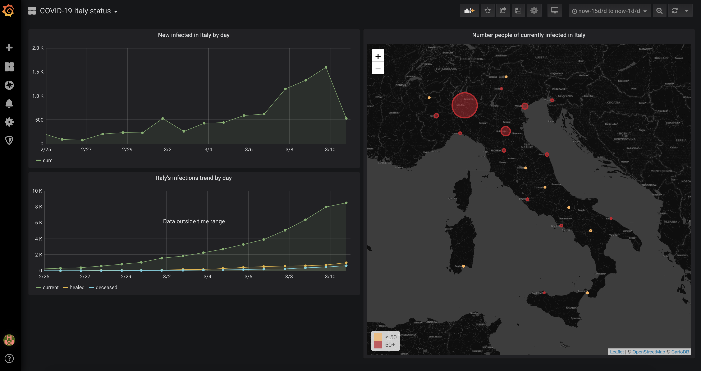

# COVID-19 Italy status monitoring by Sunnyvale S.r.l.

## Prerequisites

Having installed:
- Docker
- Docker Compose 

## Purpose

Thanks to the [open data](https://github.com/pcm-dpc/COVID-19) made available by the "Dipartimento della Protezione Civile" about COVID-19 status in Italy, we developed a Docker-based application to visualize trends and insights about current and historical infections in our country.

The application automatically fetches historical  data at the container creation phase and updates them daily at 19:00 (Italian time).

## How to run the application

To run the application, just after having forked and cloned this repo, type:

```console
$ cd covid-19-italy-dashboard/docker
$ docker-compose up -d
```

After all the containers are started, point your browser at http://\<docker host\> (in most cases http://localhost)

After having accessed Grafana using your favoured browser, select the dashboard **COVID-19 Italy status** to display all the panels as shown below:



Grafana default username and password (the last to be changed at first logon) are **admin/admin**.